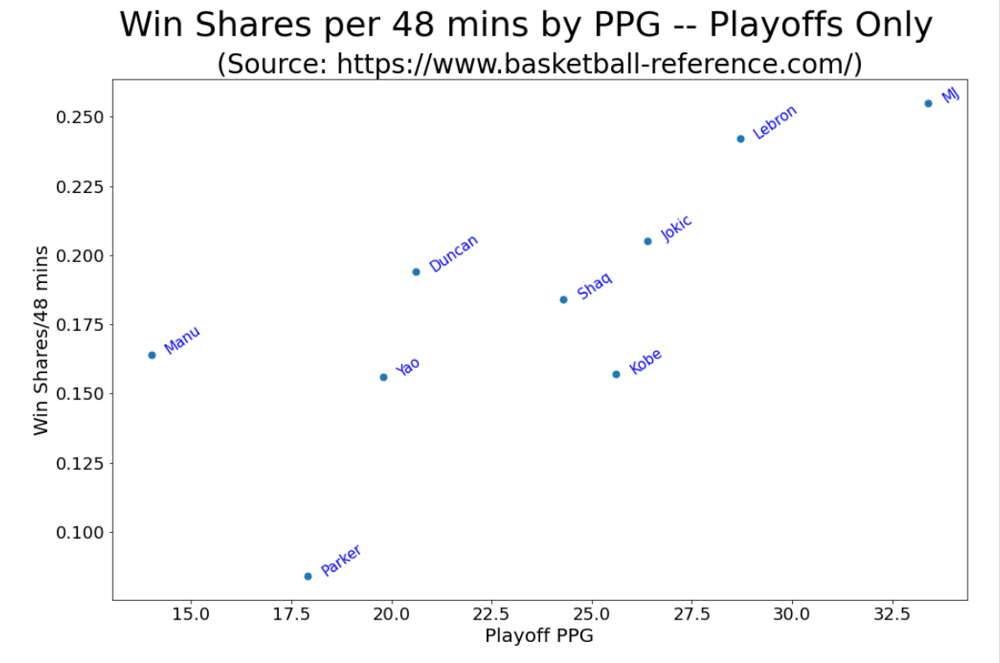
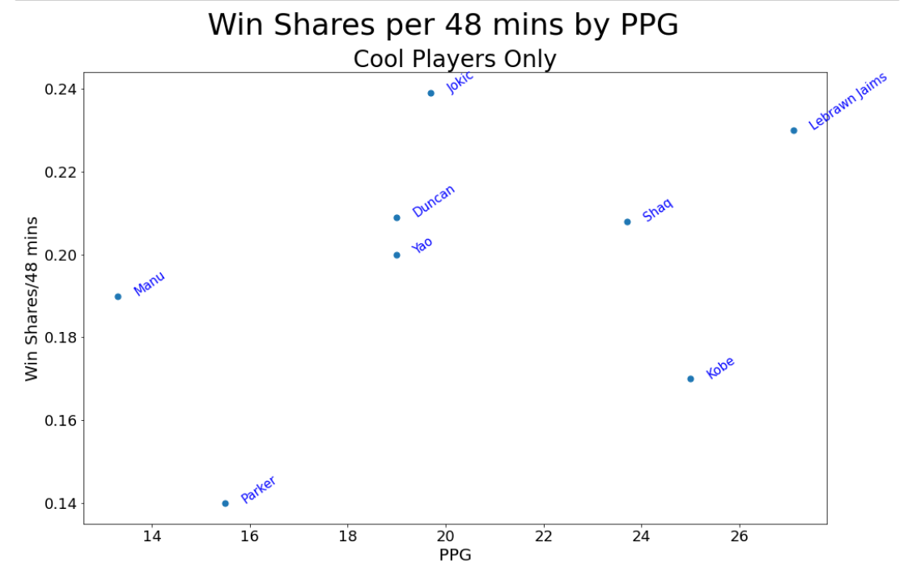

# NBA Data Analysis, Visualization, and Memeing

**Author**: [Doug Mill](mailto:douglas_mill@live.com)

## Overview 

A message popped in a group chat which showed a visualization of NBA players' career winning % along with number of games played (1000 minimum) and I became interested in exploring.e

## Business Understanding

This is just for fun to compare various NBA players.

## Data Understanding and Preparation

Manually pulled some data for a few prominent players from basketball reference. Link in notebook + shown on charts.




'Playoffs career PPG vs. Win Shares per 48' and 'regular season career PPG vs. Win Shares per 48'.


## Modeling


## Results


## Conclusion


## Future Research

Pull a full dataset of NBA statistics and do some type of analysis, visualization, or memeing.

## References

NBA stats: https://www.basketball-reference.com/

## Repository Structure

```
├── images
├── .gitignore
├── README.md
└── nba_vizmemes.ipynb
